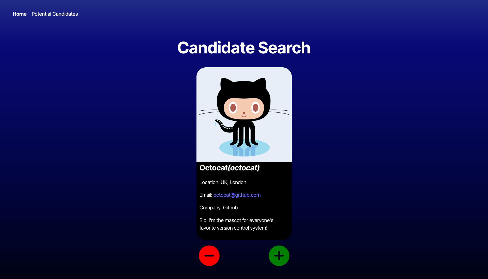

# Candidate Search


## Description
```md
This project is complete a candidate search application that calls the GitHub API and renders data in the browser.  
```
## User Story
```md
- AS AN employer
- I WANT a candidate search application
- SO THAT I can hire the best candidatesication is constantly updated when major releases are made to the main branch
```


## Table of Contents

- [Introduction](#introduction)
- [Technology](#technology)
- [Usage](#usage)
- [Contact](#credits)
- [License](#license)

## Introduction


WHEN the candidate search page loads
THEN the information for one candidate should be displayed, including the candidate's name, username, location, avatar, email, html_url, and company
WHEN I click the "+" button
THEN the candidate should be saved to the list of potential candidates and the next candidate's information should be displayed
WHEN I click the "-" button
THEN the next candidate's information should be displayed without saving the current candidate
WHEN there are no candidates available to review
THEN an appropriate message should be shown indicating no more candidates are available

THEN the user should see a list of previously saved potential candidates with their name, username, location, avatar, email, html_url, and company
WHEN the page reloads
THEN the list of potential candidates should persist and be available for viewing
WHEN there are no potential candidates
THEN an appropriate message should be displayed indicating no candidates have been accepted
WHEN I click the "-" button
THEN the next candidate's information should be displayed without saving the current candidate


## Technology

[](https://nodejs.org/)
[](https://www.postgresql.org/)

[](https://www.typescriptlang.org/)
[](https://www.npmjs.com/)
[](https://code.visualstudio.com/docs)

## Usage
- [Github Repo](https://github.com/dcruzel/CandidateSearch)
- [Deployed Website](https://candidatesearch-5d1y.onrender.com/)


## Contact

Elizabeth D'Cruz
- [Github Profile](https://github.com/dcruzel)
- [Email](Liz.c.dcruz@gmail.com)

## License

[](https://opensource.org/licenses/MIT)

